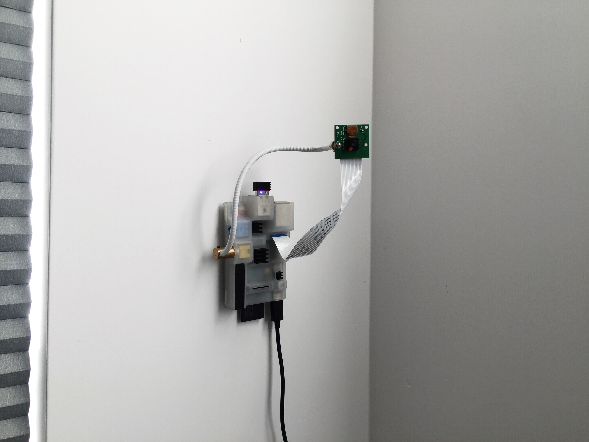

[labs.édouard.us/ss](http://labs.edouard.us/ss/) :palm_tree:

—

Snapshots, 11AM ⟳ 11PM.

Project inspired by [Jefferey Scudder](http://ss.rey.sc/). :bookmark:

Helped via [this](http://www.raspberrypi-spy.co.uk/2013/05/creating-timelapse-videos-with-the-raspberry-pi-camera/), [this](http://blog.davidsingleton.org/raspberry-pi-webcam-a-gentle-intro-to-crontab/), [this](http://www.adminschoice.com/crontab-quick-reference), and [this](https://www.raspberrypi.org/documentation/raspbian/applications/camera.md).

—

